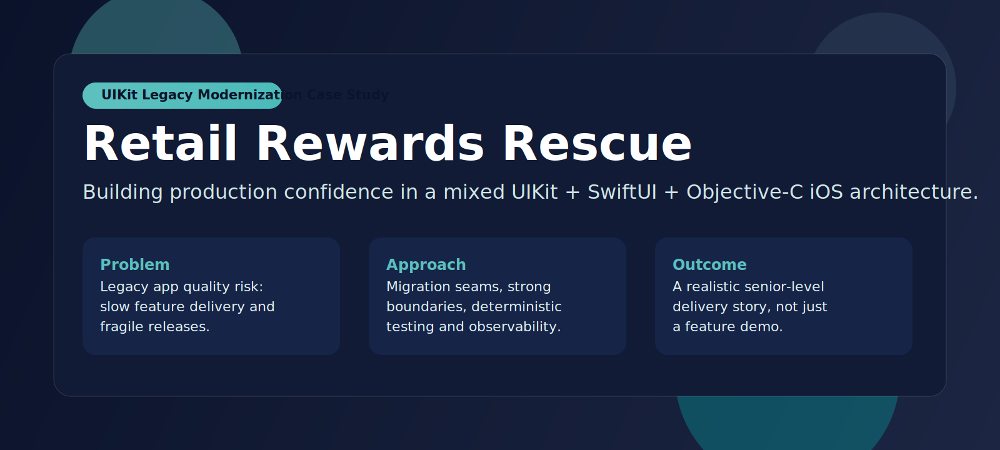
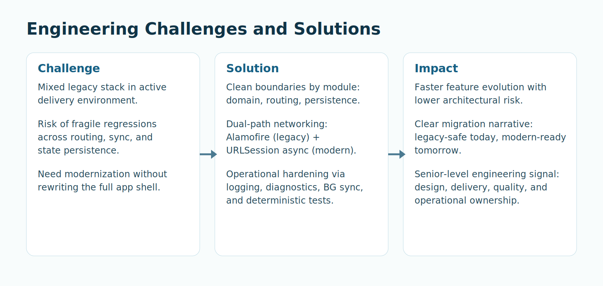
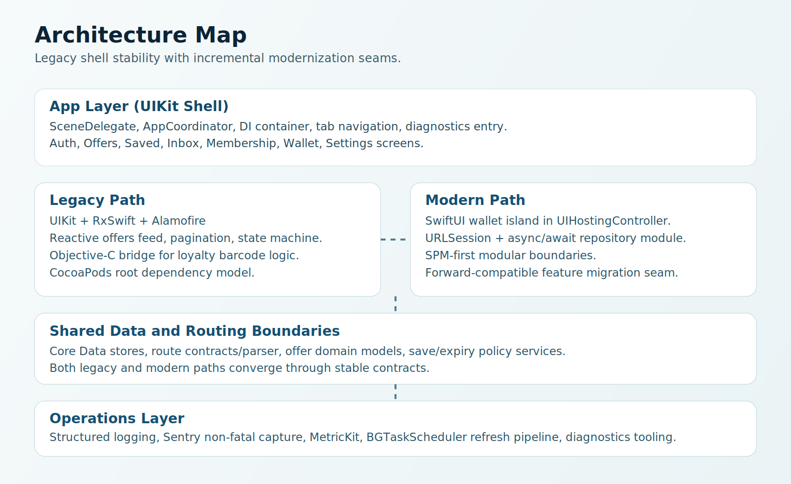

# Retail Rewards Rescue



[](https://developer.apple.com/ios/)
[](#architecture-strategy)
[](#architecture-strategy)
[](#technology-used)
[](#technology-used)

## Executive Summary
Retail Rewards Rescue is a production-style iOS case study focused on **legacy modernization without product instability**.

This project is intentionally not a greenfield demo. It simulates a real situation where a team must:
- continue shipping features in an existing UIKit app,
- reduce regression risk,
- introduce modern patterns incrementally,
- and maintain operational quality (diagnostics, observability, testability, release automation).

The result is a complete migration story that demonstrates senior-level engineering ownership across architecture, delivery, and quality.

## The Problem We Solved
Most portfolio projects show ideal conditions. Real product teams rarely have that.

The actual engineering problem addressed here:
- UIKit-heavy shell and legacy dependencies already exist.
- New features still need to ship fast.
- Full rewrite is too risky and too expensive.
- Routing, background refresh, and persistence bugs can silently damage UX.
- Operational visibility is often missing in demo apps.

We solved this by creating **explicit migration seams** and **strong boundaries** instead of rewriting everything.

## Challenges We Had and How We Solved Them


| Challenge | What could go wrong | Solution implemented | Why this is senior-level |
|---|---|---|---|
| Mixed legacy stack (UIKit + Rx + Alamofire) | Rewrites break stable flows | Kept legacy shell, introduced modular boundaries and contracts | Prioritizes business continuity over technical ego |
| Need modernization without disruption | Feature work blocks on architecture rewrite | Added SwiftUI as an isolated wallet island in UIKit | Incremental modernization with low blast radius |
| Inconsistent state across feed/detail/saved | Save state drift and stale expired offers | Added persistence-backed save service + expiry reconciliation policy | Domain rule ownership, not view-level hacks |
| Routing complexity (scheme + universal links + inbox links) | Crashes/misroutes on malformed inputs | Strongly modeled routes + parser tests + guarded handling | Defensive design and safe failure behavior |
| Stale data while app is backgrounded | User sees outdated inbox/offers | BGTask refresh pipeline + foreground/background sync policy + throttling | Handles lifecycle realities and resource limits |
| Hard-to-debug production issues | Silent failures, unclear root causes | Structured logs, Sentry non-fatal capture, MetricKit, diagnostics screen | Operability built into architecture |
| Quality confidence at scale | Regressions in CI/release | Unit + Rx + UI smoke + snapshot + performance tests; CI and Fastlane | End-to-end delivery discipline |

## Architecture Strategy


### Design principles
- Clean architecture boundaries around domain, routing, persistence, and platform services.
- High cohesion, low coupling, explicit dependency flow.
- Legacy compatibility first, modernization second.
- Deterministic tests for every critical business rule seam.

### Migration seams
- **Legacy path**: UIKit + RxSwift + Alamofire.
- **Modern path**: SwiftUI wallet + URLSession async/await modules.
- **Interop seam**: Objective-C `LegacyLoyaltyKit` wrapped by Swift bridge.
- **Shared seam**: route contracts, domain models, persistence abstractions.

## Product Capabilities
- Authentication with validation, secure session persistence, biometric gate.
- Offers feed with loading/empty/error/content states, pagination, SDWebImage cards.
- Offer detail with save/unsave and expiry-aware behavior.
- Saved offers with Core Data + NSFetchedResultsController offline-first rendering.
- Inbox local-first list, read/unread state, safe deep-link handling in message detail.
- Membership card using Objective-C barcode payload generation/validation.
- Rewards wallet implemented in SwiftUI and embedded into UIKit.
- Deep links via custom scheme and universal link support.
- Background refresh with sync policy, throttling, and merge pipeline.
- Diagnostics screen with route testing, cache clearing, test error capture, refresh controls.

## Technology Used
### Core app and UI
- UIKit (app shell, coordinator, feature screens)
- SwiftUI (wallet migration island)
- MVVM + Coordinator
- Storyboard/XIB + programmatic UI mix

### Reactive and networking
- RxSwift / RxCocoa / RxRelay (legacy reactive flows)
- Alamofire (legacy networking path)
- URLSession async/await (modern networking path)

### Data and storage
- Core Data
- NSFetchedResultsController

### Interop and platform
- Objective-C bridge (`LegacyLoyaltyKit`)
- BGTaskScheduler
- OSLog structured logging
- Sentry
- MetricKit
- SDWebImage

### Build and delivery
- CocoaPods (legacy root app dependency model)
- Swift Package Manager (modularized new code)
- SwiftLint
- Fastlane
- GitHub Actions
- XcodeGen

## Quality and Trust Signals
### Tests
- Package unit tests (`swift test`) for domain/data contracts.
- App unit tests for save policy, bridge seam, reactive view model behavior.
- Rx tests (`RxTest`, `RxBlocking`) for deterministic reactive flow verification.
- UI smoke and accessibility identifier tests for primary user path.
- Snapshot-style hierarchy tests for UI state regression checks.
- Performance baselines for persistence latency.

### Operational maturity
- Structured logs by category with metadata and redaction support.
- Sentry non-fatal capture on critical failure paths.
- MetricKit payload tracking and surfacing in diagnostics.
- Documented release checklist and sync policy.

## Why This Project Signals Senior Engineering
This repository demonstrates more than coding features:
- **Architecture judgment**: chose safe migration over rewrite.
- **Systems thinking**: tied UX behavior to lifecycle, persistence, and routing constraints.
- **Risk management**: added guardrails for malformed routes, stale data, and background sync conflicts.
- **Operational ownership**: observability + diagnostics are first-class, not afterthoughts.
- **Delivery discipline**: CI, automation lanes, release process, and documentation align with implementation.

## Run Locally
### Prerequisites
- Xcode 16+
- CocoaPods
- XcodeGen
- SwiftLint

### Bootstrap
```bash
./scripts/bootstrap.sh
open RetailRewardsRescue.xcworkspace
```

### Demo credentials
- Email: `demo@retailrescue.app`
- Password: `password123`

### Commands
```bash
./scripts/lint.sh
./scripts/test.sh
./scripts/test_app.sh
./scripts/test_ui.sh
```

### Fastlane
```bash
fastlane ios lint
fastlane ios package_tests
fastlane ios app_tests
fastlane ios ui_smoke
fastlane ios build
fastlane ios ci
```

## Documentation
- [Architecture Overview](docs/architecture-overview.md)
- [Migration Strategy](docs/migration-strategy.md)
- [Routing and Links](docs/routing-and-links.md)
- [Sync Policy](docs/sync-policy.md)
- [Observability Plan](docs/observability-plan.md)
- [Testing Strategy](docs/testing-strategy.md)
- [Accessibility Checklist](docs/accessibility-checklist.md)
- [Release Checklist](docs/release-checklist.md)
- [Demo Script](docs/demo-script.md)
- [KPI Report Template](docs/kpi-report-template.md)

## Repository Layout
```text
App/            UIKit app shell, features, coordinator, diagnostics
Legacy/         Alamofire adapters + Objective-C loyalty module
Packages/       SPM modules (Core, Routing, Persistence, etc.)
Tests/          App, UI, snapshot, and performance tests
docs/           Architecture, operations, and delivery documentation
scripts/        Bootstrap, lint, test, build automation
fastlane/       Delivery lanes used locally and in CI
```

## Roadmap for Further Hardening
- Add visual snapshot goldens on simulator matrix.
- Add contract tests for background refresh merge strategy.
- Add richer telemetry dashboards from MetricKit/Sentry exports.
- Expand accessibility audits with dynamic type screenshot matrix.

---
If you are evaluating this repository for senior iOS capability, inspect the migration boundaries, failure handling, test strategy, and operations tooling together. That combination is the core value of this project.
